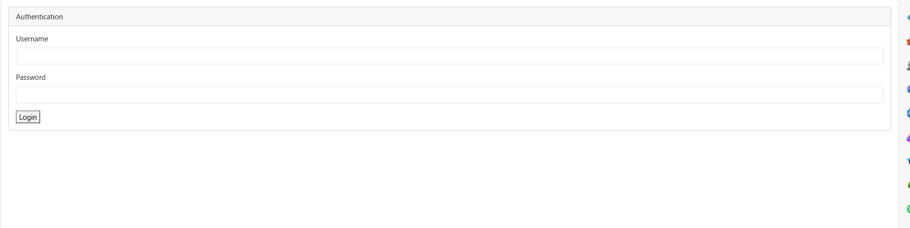
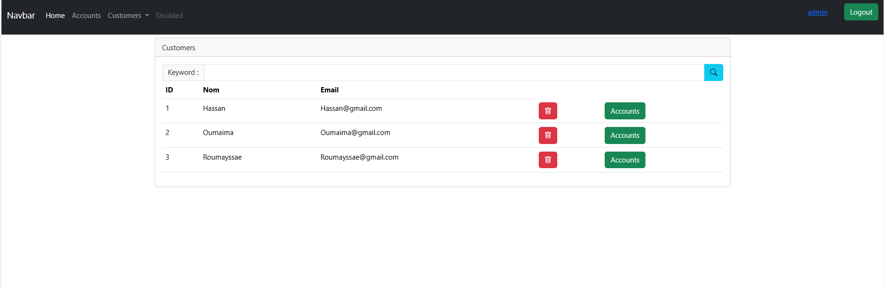
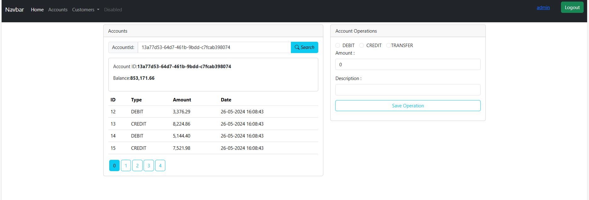
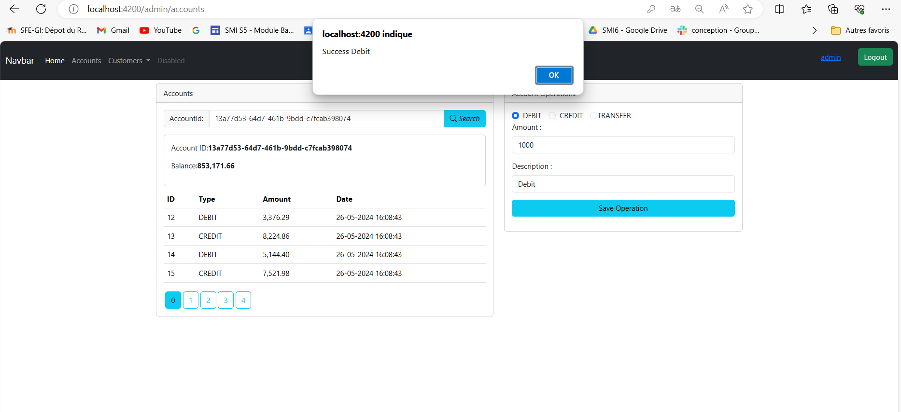
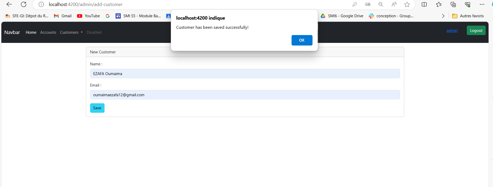
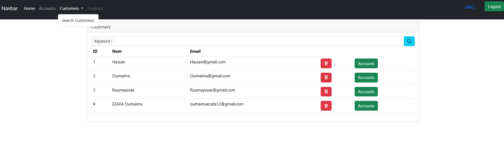
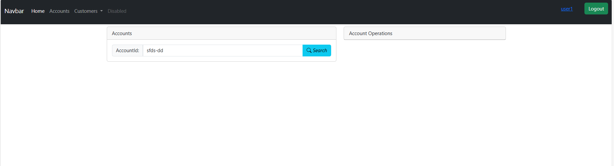

<h1>Compte rendu du Projet Spring Angular JWT - Gestion de Comptes Bancaires</h1>

Dans le cadre du projet Spring Angular JWT, notre objectif était de concevoir une application de gestion de comptes bancaires, permettant à chaque compte d'appartenir à un client. Les comptes peuvent être de deux types : comptes courants et comptes épargnes, et peuvent subir des opérations de débit ou de créditou transfert.

<h2>Backend :</h2>

Dans la première partie du projet, nous avons mis en place le backend en utilisant Spring Boot. Nous avons créé les entités JPA telles que Customer, BankAccount, SavingAccount, CurrentAccount et AccountOperation. Ensuite, nous avons mis en place les interfaces JPA Repository basées sur Spring Data pour interagir avec la base de données. Après avoir testé la couche DAO, nous avons développé la couche service,``` les DTOs``` et ```les mappers```, ainsi que les contrôleurs Rest pour exposer les web services Restful. Pour documenter nos API, nous avons utilisé Swagger avec la dépendance ```springdoc-openapi-starter-webmvc-ui.```
-Entities (Entités) : Les entités représentent les objets métier de l'application et sont utilisées pour représenter les tables de la base de données. Elles contiennent des attributs et des relations qui décrivent les données de l'application.

-Repositories (Répertoires) : Les repositories sont utilisés pour l'accès aux données. Ils fournissent des méthodes permettant d'effectuer des opérations CRUD (Create, Read, Update, Delete) sur les entités, facilitant ainsi l'interaction avec la base de données.
<h3>Strecture de projet </h3>
-DTOs (Data Transfer Objects): Les DTOs sont utilisés pour transférer des données entre les différentes couches de l'application. Ils permettent de structurer et de transférer uniquement les données nécessaires, améliorant ainsi les performances et la sécurité.

-Mappers (Mappateurs) : Les mappers sont utilisés pour convertir les objets entre différentes représentations, par exemple entre les entités et les DTOs. Ils facilitent la transformation des données en effectuant des opérations de mapping appropriées.

-Web : La couche Web fournit des composants tels que les RestControllers qui exposent les fonctionnalités de l'application via des API REST. Elle gère les requêtes HTTP entrantes et renvoie les réponses appropriées.

-Service : La couche de service contient la logique métier de l'application. Elle traite les opérations complexes, effectue des validations, coordonne l'interaction entre les différentes entités et gère les transactions.

-Exception : Les exceptions sont utilisées pour gérer les erreurs et les situations exceptionnelles dans l'application. Elles permettent de gérer les cas d'échec, d'erreur de validation ou toute autre situation qui nécessite une gestion particulière.

-Security :inclut la gestion de l'authentification et de l'autorisation de l'application. JSON Web Token (JWT) est utilisé pour sécuriser les communications entre le client et le serveur. Il permet de créer des jetons de sécurité signés qui contiennent les informations d'identification et les autorisations de l'utilisateur, garantissant ainsi que seules les parties autorisées peuvent accéder aux ressources protégées.

<H2>
Client Angular :</h2>

Dans la deuxième partie, nous avons créé le client Angular pour notre application. Nous avons mis en place les fonctionnalités nécessaires pour gérer les clients et les comptes, y compris l'ajout, la suppression, l'édition et la recherche. De plus, nous avons sécurisé notre application en utilisant Spring Security et Json Web Token pour l'authentification. 


Ce projet nous a permis d'acquérir une expérience pratique en développant une application complète de gestion de comptes bancaires, en utilisant les technologies Spring Boot pour le backend et Angular pour le frontend, ainsi qu'en mettant en œuvre des fonctionnalités de sécurité avancées avec Spring Security et JWT.

<h3>Les screens de l'application:</h3>




    ```Partie ADMIN```










`` PARTIE Utilisateur ``






