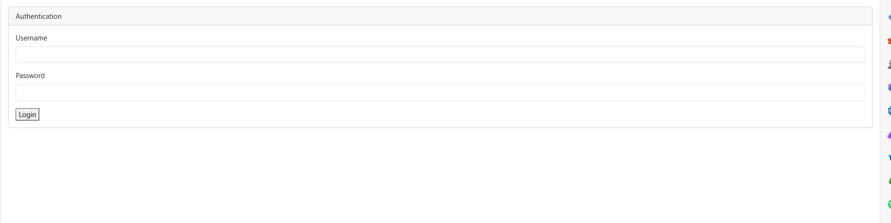
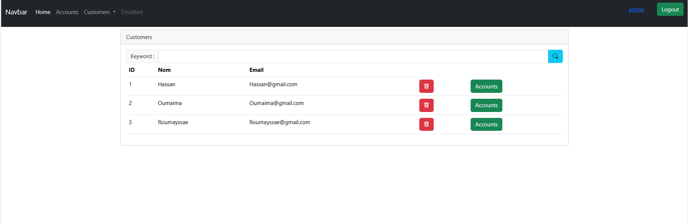
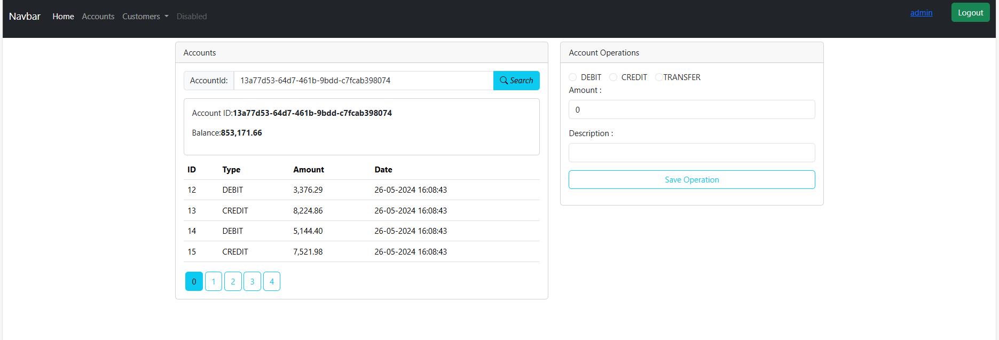
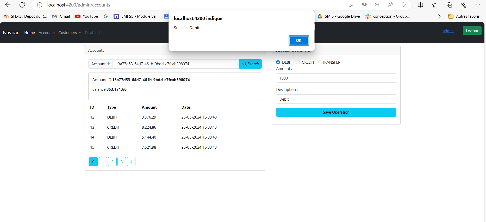
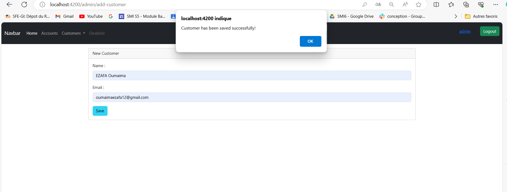
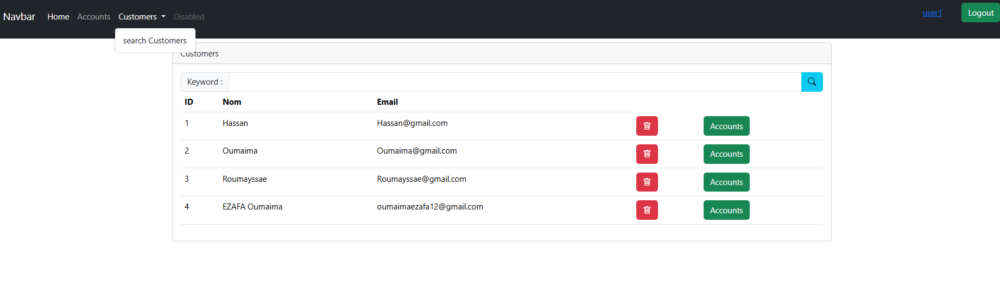
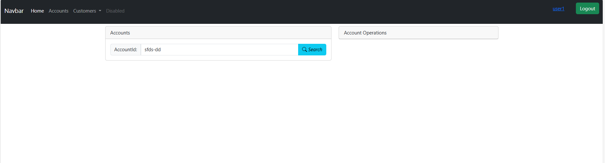

<h1>Compte rendu du Projet Spring Angular JWT - Gestion de Comptes Bancaires</h1>

Dans le cadre du projet Spring Angular JWT, notre objectif était de concevoir une application de gestion de comptes bancaires, permettant à chaque compte d'appartenir à un client. Les comptes peuvent être de deux types : comptes courants et comptes épargnes, et peuvent subir des opérations de débit ou de crédit.

<h2>Backend :</h2>

Dans la première partie du projet, nous avons mis en place le backend en utilisant Spring Boot. Nous avons créé les entités JPA telles que Customer, BankAccount, SavingAccount, CurrentAccount et AccountOperation. Ensuite, nous avons mis en place les interfaces JPA Repository basées sur Spring Data pour interagir avec la base de données. Après avoir testé la couche DAO, nous avons développé la couche service,``` les DTOs``` et ```les mappers```, ainsi que les contrôleurs Rest pour exposer les web services Restful. Pour documenter nos API, nous avons utilisé Swagger avec la dépendance ```springdoc-openapi-starter-webmvc-ui.```
<H2>
Client Angular :</h2>

Dans la deuxième partie, nous avons créé le client Angular pour notre application. Nous avons mis en place les fonctionnalités nécessaires pour gérer les clients et les comptes, y compris l'ajout, la suppression, l'édition et la recherche. De plus, nous avons sécurisé notre application en utilisant Spring Security et Json Web Token pour l'authentification. 


Ce projet nous a permis d'acquérir une expérience pratique en développant une application complète de gestion de comptes bancaires, en utilisant les technologies Spring Boot pour le backend et Angular pour le frontend, ainsi qu'en mettant en œuvre des fonctionnalités de sécurité avancées avec Spring Security et JWT.

<h3>Les screens de l'application:</h3>




    ```Partie ADMIN```










`` PARTIE Utilisateur ``






